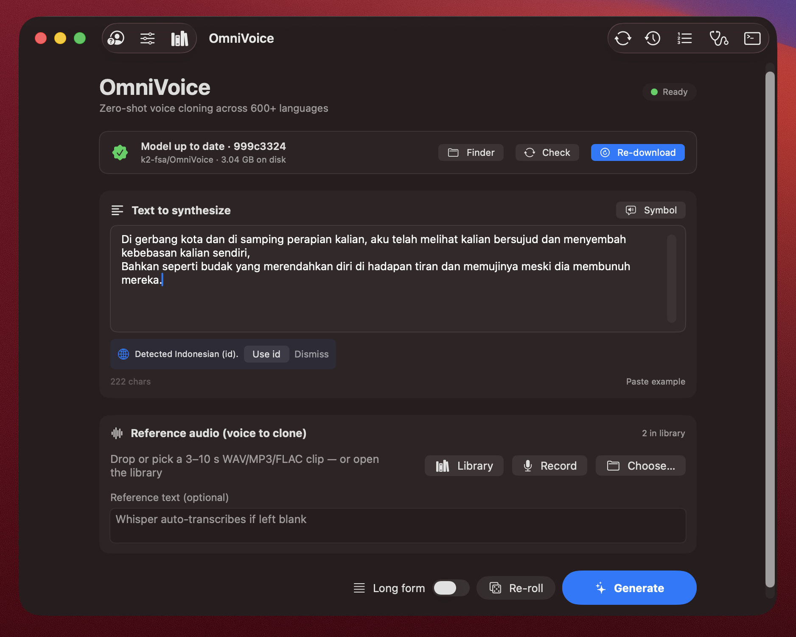

<p align="center">
  
</p>

<h1 align="center">MacOmniVoice</h1>

<p align="center">
  A native macOS SwiftUI app for <a href="https://github.com/k2-fsa/OmniVoice">OmniVoice</a> — the state-of-the-art massively multilingual zero-shot TTS / voice-cloning model.
</p>

<p align="center">
  
  
  
  
</p>

---

<p align="center">
  
</p>

MacOmniVoice is a real macOS application. SwiftUI for the UI; under the hood it manages a private Python virtual environment, drives a long-lived `omnivoice` subprocess over a JSON-line protocol, and surfaces the whole stack — install, model download, generation, library, history, queues — as native panels, sheets, and toolbars.

Designed for people who want OmniVoice's voice quality without keeping a terminal open.

## Features

### Voice cloning & synthesis
- 🎙️ **Voice cloning** — drop a 3–10 s reference clip, type some text, click **Generate**.
- ✍️ **Voice design** — first-class chip picker for gender / age / pitch / accent / Chinese dialect, plus freeform custom attributes and saved presets. No reference needed.
- 🎲 **Re-roll** — same text, same reference, bumped class-temperature for an alternative take.
- 📖 **Long-form mode** — auto-splits long text by sentence, synthesizes each chunk, stitches them into one WAV with a progress bar.
- 📋 **Batch queue** — paste many lines or import a `.txt`, render the whole list sequentially.
- 💡 **Non-verbal symbol picker** — one-click insertion of `[laughter]`, `[sigh]`, `[question-en]`, `[surprise-*]`, etc.
- 🌐 **Language auto-detect** — `NaturalLanguage`-based pill suggests the right `language` setting whenever your text disagrees with the current one.

### Reference audio library
- 📚 **Named library of voice samples** with description and optional transcript.
- 🏷️ **Tags + search + favourites** — chip filter for tags, full-text search across name / description / transcript / tags, star clips to surface them.
- 🎙️ **In-app recorder** — records mono 24 kHz PCM straight into the library (matches OmniVoice sample rate, no resampling).
- ✂️ **Trim** — two-handle range slider with sample-accurate cropping in place.
- 🤖 **Whisper auto-transcribe** — clips imported without a transcript are transcribed automatically (faster-whisper → openai-whisper → transformers fallback). Pre-filling the transcript skips Whisper on each Generate.
- 🧪 **Test this voice** — synthesizes a fixed pangram with the selected clip so you can audition it.

### History & projects
- 🕒 **Generation history** — every successful synth is persisted with text, reference, every parameter, and elapsed time. Click any row to load it back into the main view.
- 💾 **Project files** — `Open Project…` (⌘O) / `Save Project…` (⌘S) round-trip text + reference + every advanced parameter via a `.omnivoice` JSON document.
- 🔊 **Export** — convert the output to **WAV / CAF / FLAC** (configurable sample rate + bit depth) or **AAC / M4A** via `AVAssetExportSession`.

### Robustness & diagnostics
- 🤖 **Auto setup** — first run detects host Python ≥ 3.10, creates a private venv, installs PyTorch + `omnivoice` with live progress.
- 📦 **Auto model download** — pulls `k2-fsa/OmniVoice` (~3 GB) from HuggingFace via `huggingface_hub.snapshot_download`. Xet Storage is disabled because the `hf_xet` client stalls — plain HTTPS is much more reliable.
- 📊 **Real download progress** — a Python-side cache poller emits 1 Hz progress events, so the bar moves even when `tqdm.update()` doesn't fire. Progress shows actual on-disk bytes vs HF tree total.
- 🔄 **Update check** — compares the local snapshot SHA against the HuggingFace head commit and shows **Download / Update / Resume / Re-download** based on actual completeness.
- ❤️ **Auto-restart Python runner** — if the subprocess dies, it relaunches and the engine reseats its state cleanly.
- 🩺 **Diagnostics window** — SHA-256 model integrity check against the HF LFS manifest, post-install self-test, and a one-click debug-bundle ZIP (system info + engine log + ref-library + pip freeze + active runner script) into `~/Downloads/`.
- 🛡️ **Pre-flight gate** — the Generate button disables when something is wrong, with a concrete reason and a fix ("Click the Download button to fetch the ~3 GB model", "Loading model into memory…", "One synthesis at a time", etc.).

### Apple-Silicon polish
- ⚡ Uses the PyTorch `mps` backend by default (CPU fallback selectable).
- ⏱️ Live `Generating… 12.4s` timer (heartbeat from the Python runner) so it never looks frozen on slow MPS ops.
- 🪶 Default `num_step = 16` for ~2× faster synthesis on Apple Silicon with only a small quality hit (OmniVoice's own README recommends 16).

## Requirements

- macOS 14 (Sonoma) or newer — Apple Silicon recommended
- A host Python ≥ 3.10 on PATH (Homebrew `python@3.11`, python.org installer, or Xcode CLT all work)
- ~6 GB free disk space (PyTorch + ~3 GB model)
- Internet on first run

The app **never modifies your system Python**. All Python deps land in a dedicated venv at:

```
~/Library/Application Support/MacOmniVoice/venv
```

Model weights cache in the standard `~/.cache/huggingface/` location. Generated audio and the reference library live in `~/Library/Application Support/MacOmniVoice/`.

## Build & run

```bash
# Quick run (debug, no bundle):
swift run

# Build a proper .app bundle (ad-hoc signed):
./Scripts/build-app.sh                # release
CONFIG=debug ./Scripts/build-app.sh   # debug

open build/MacOmniVoice.app
# or
cp -R build/MacOmniVoice.app /Applications/
```

## First-run flow

1. Launch the app. The setup screen verifies your host Python and offers **Install OmniVoice**.
2. Click it. The log streams as the venv is created and PyTorch + `omnivoice` install (~3–5 GB, several minutes).
3. The main screen appears with the model status bar. Click **Download** once to pull the model from HuggingFace (~3 GB).
4. Type some text, pick or record a reference audio, click **Generate**.

The Python subprocess stays alive between requests, so only the first generation pays the model-load cost. Subsequent generations skip both load and download.

## Architecture

```
┌────────────────────────────────────┐
│  SwiftUI app (MacOmniVoice)        │
│  ─ MainView · Voice Design panel   │
│  ─ Reference Library (+ Recorder)  │
│  ─ History / Queue / Diagnostics   │
│  ─ AppState (Combine-forwarded)    │
└──────────────────┬─────────────────┘
                   │ JSON-line over pipes
                   ▼
┌────────────────────────────────────┐
│  omnivoice_runner.py (Python)      │
│  ─ load / synth / download / verify│
│  ─ heartbeat threads for progress  │
│  ─ Whisper auto-transcribe         │
└────────────────────────────────────┘
                   │
                   ▼
   PyTorch · omnivoice · HuggingFace Hub
```

The runner stays loaded after the first `load` so subsequent `synthesize` calls skip startup cost.

## JSON-line protocol

| Action       | Purpose                                       |
|--------------|-----------------------------------------------|
| `ping`       | health check                                  |
| `load`       | `OmniVoice.from_pretrained(model_id)`         |
| `synthesize` | `model.generate(**kwargs)` → WAV on disk      |
| `download`   | `snapshot_download(model_id)` w/ progress     |
| `verify`     | SHA-256 every cached blob vs HF LFS manifest  |
| `transcribe` | Whisper auto-transcribe a reference clip      |
| `model_info` | local cache + revision report                 |
| `quit`       | graceful shutdown                             |

All advanced kwargs are passed through verbatim; the runner introspects `model.generate()`'s signature and drops anything the installed `omnivoice` version doesn't accept, so the app stays compatible across upstream versions.

## Tips

- Use a 3–10 s reference clip in the **same language** as your target text.
- For long passages, enable **Long-form** — the diffusion model has a per-utterance budget and degrades on long inputs.
- Toggle **Pre-process prompt** (default on) for text normalisation; disable if you're using inline phonemes or pinyin.
- For voice *design* (no reference audio), open the Voice Design panel from the toolbar and chip-pick attributes.
- If HuggingFace is unreachable from your network, launch with `MACOMNIVOICE_HF_MIRROR=1 open build/MacOmniVoice.app` to route through `hf-mirror.com`.
- Xet Storage is disabled by default because the `hf_xet` client hangs after auth; set `MACOMNIVOICE_USE_XET=1` to re-enable it if a future release fixes the bug.

## Project layout

```
MacOmniVoice/
├── Package.swift
├── Scripts/build-app.sh
├── docs/icon.png
└── Sources/MacOmniVoice/
    ├── MacOmniVoiceApp.swift         · @main + Save/Open menu
    ├── AppState.swift                · top-level glue, child re-publish
    ├── Models/
    │   ├── AppSettings.swift         · persisted prefs
    │   ├── SynthesisRequest.swift    · → Python kwargs
    │   ├── ReferenceClip.swift       · library entries
    │   ├── GenerationRecord.swift    · history rows
    │   └── ProjectDocument.swift     · .omnivoice files
    ├── Services/
    │   ├── PythonRuntime.swift       · venv + auto-restart runner
    │   ├── ModelManager.swift        · HF Hub head + tree size
    │   ├── SynthesisEngine.swift     · long-form + queue + record
    │   ├── ReferenceLibrary.swift    · persisted ref clips
    │   ├── GenerationHistory.swift   · persisted outputs
    │   ├── SynthesisQueue.swift      · batch processing
    │   ├── TranscriptionService.swift· Whisper bridge
    │   ├── DiagnosticsService.swift  · verify / self-test / bundle
    │   ├── LanguageDetector.swift    · NaturalLanguage
    │   ├── TextSplitter.swift        · sentence segmentation
    │   ├── AudioConcat.swift         · long-form stitching
    │   ├── AudioTrim.swift           · in-library crop
    │   ├── AudioExporter.swift       · WAV/CAF/FLAC/AAC/M4A
    │   └── AudioRecorderService.swift· 24 kHz PCM recorder
    ├── Views/
    │   ├── RootView.swift            · stage router
    │   ├── SetupView.swift           · first-run installer
    │   ├── MainView.swift            · synthesis surface
    │   ├── AdvancedSettingsView.swift· every knob
    │   ├── VoiceDesignPanel.swift    · attribute chips + presets
    │   ├── SymbolPickerPopover.swift · non-verbal tags
    │   ├── ReferenceLibraryView.swift· library browser
    │   ├── SaveToLibrarySheet.swift  · import from main view
    │   ├── TrimSheet.swift           · range-slider trim
    │   ├── RecorderPopover.swift     · live record UI
    │   ├── HistoryView.swift         · generation history
    │   ├── QueueView.swift           · batch queue
    │   ├── DiagnosticsView.swift     · verify / self-test / bundle
    │   ├── ModelStatusBar.swift      · live download progress
    │   ├── OutputPlayerCard.swift    · play / save / export
    │   ├── ExportSheet.swift         · format picker
    │   └── ConsolePanel.swift        · runner log
    └── Resources/
        ├── Assets/AppIcon.icns       · ships into Contents/Resources
        └── omnivoice_runner.py       · Python bridge
```

## Acknowledgements

- [OmniVoice](https://github.com/k2-fsa/OmniVoice) by the k2-fsa team — the model and inference library this app drives.
- [HuggingFace Hub](https://huggingface.co/) for model hosting.
- App icon designed for this project.

## License

App code is MIT (see [LICENSE](LICENSE)). The OmniVoice model and inference library it drives are Apache-2.0 — see the upstream [OmniVoice repository](https://github.com/k2-fsa/OmniVoice) for those terms.
